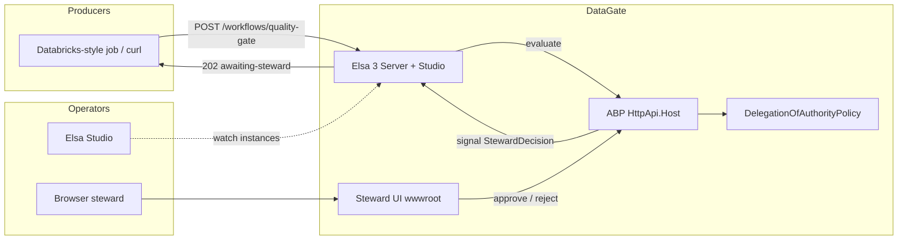
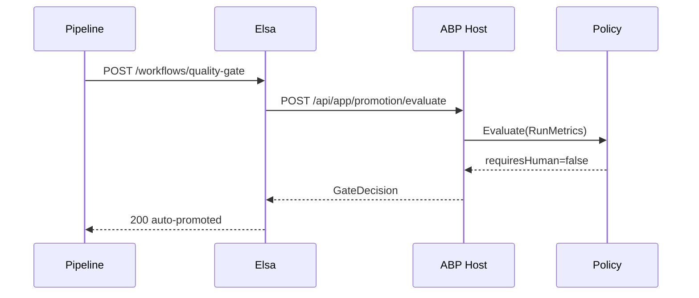
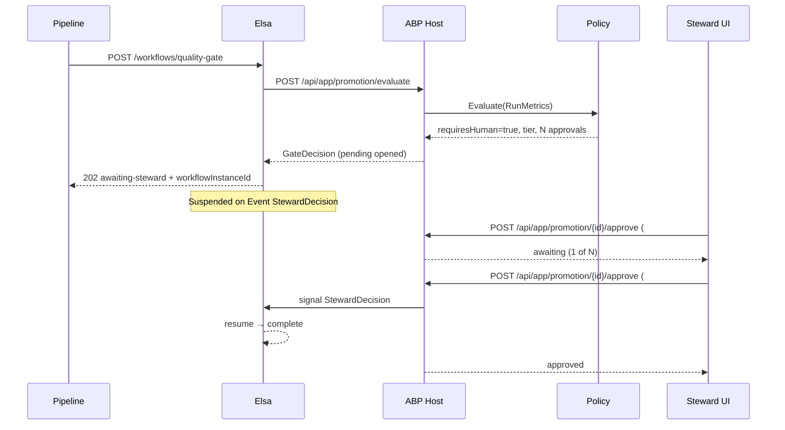
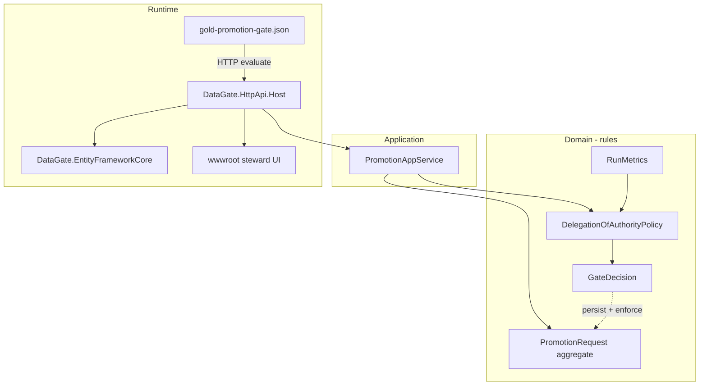

# DataGate architecture

Governed **silver → gold** promotion for data pipelines: most runs auto-promote;
risky runs suspend until the right humans approve via a lightweight steward UI
on the ABP HttpApi host.

## Design principle

| Kind of knowledge | Form | Reason |
|---|---|---|
| **Rules** (who must approve, by how much risk) | C# + unit tests | Diffable, reviewable, not hidden in a diagram |
| **Process** (wait, resume, notify) | Versioned Elsa workflow JSON | Visible to non-engineers; change via PR of an artifact |

Putting rules in the workflow makes them untestable. Putting process only in
code makes it invisible to the business. The boundary is intentional.

## Context

## Containers (local stack)

| Container | Image / build | Port | Responsibility |
|---|---|---|---|
| `datagate-elsa` | `elsaworkflows/elsa-server-and-studio-v3` | `13000` | HTTP webhook, durable workflow, Studio |
| `datagate-api` | `src/DataGate.HttpApi.Host` | `5001` | ABP evaluate/approve + steward UI + EF |
| `datagate-sql` | SQL Server 2022 | `1433` | Persistence for the ABP host |

Compose: `deploy/docker-compose.yml` (`--env-file .env`).

## Sequence

### Clean run (auto-promote)

### Dirty run (human gate)

## Components

| Layer | Path | Role |
|---|---|---|
| Domain | `src/DataGate.Domain*` | Policy + aggregates (tested) |
| Application | `src/DataGate.Application*` | Evaluate / approve / pending / Elsa signal |
| EF Core | `src/DataGate.EntityFrameworkCore` | `PromotionRequest` + owned approvals |
| Host | `src/DataGate.HttpApi.Host` | Open-source ABP host + lightweight UI |
| Workflow | `workflow/definitions/gold-promotion-gate.json` | Orchestration only (no thresholds in JS) |

## Decision model

Input (`RunMetrics`): drift %, null %, new columns, financial exposure, sensitive
data, regulatory flag.

`DelegationOfAuthorityPolicy` derives:

- `requiresHuman`
- `requiredTier` (Steward → Owner → Director → CDO by exposure / sensitivity)
- `requiredApprovals` (2 when exposure or PII trips the two-person rule)
- `slaHours` and a plain-English `reasonSummary`

The workflow **never** re-implements those rules. It only branches on
`requiresHuman` and waits for `StewardDecision`.

## HTTP surfaces

| Actor | Method | URL |
|---|---|---|
| Pipeline | `POST` | `http://localhost:13000/workflows/quality-gate` |
| Elsa → API | `POST` | `http://api:8080/api/app/promotion/evaluate` |
| Steward UI | browser | `http://localhost:5001` |
| Steward API | `POST` | `http://localhost:5001/api/app/promotion/{id}/approve` |
| Pending | `GET` | `http://localhost:5001/api/app/promotion/pending-list` |
| Operator | browser | `http://localhost:13000` (admin / password) |

Approve body: `approverId`, `approverTier`, optional `workflowInstanceId`, `comment`.
Two distinct approver ids when the policy requires two signatures. Samples:
`tools/simulate-run.http`.

## Evolution

| Now (demo) | Next |
|---|---|
| Open approve HTTP (UI picks approver id + tier) | ABP Identity / OpenIddict + `DataGatePermissions` |
| Stock Elsa image + HTTP call-out | Optional custom Elsa host loading `EvaluateGateActivity` |
| No SLA auto-quarantine in the live graph | Timer with durable store |

## Demo numbers

- Clean run: **0 humans**, milliseconds.
- $3M + new PII column: **Director**, **2** approvals, **8h** SLA — all from the
  policy, not from the flowchart.
